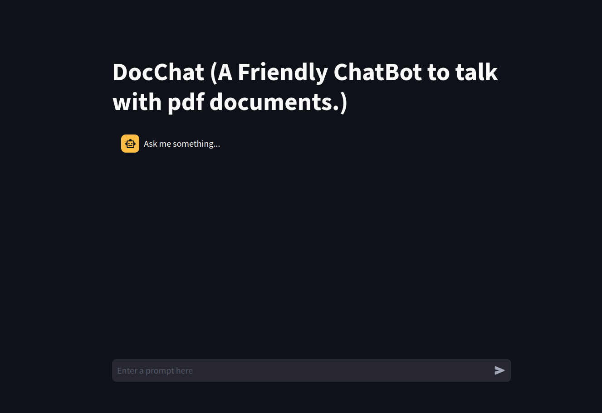

# DocChat

This is a DocChat which can be used to talk with any pdf document using Large Language Models.



## Tech Stack
- Streamlit (For UI)
- Llama Index (For Automerge Index and Retreiver)
- OpenAI GPT-3.5-Turbo (For Embeddings and Chat)

## Prerequisites
- Docker installed on your machine

## Quick Start

1. Add the link tp your pdf file in `src/build_index.py` file.

2. Run docker-commad to build:
    `docker build -t case-bot .`

3. Run docker container:
    `docker run -p 8501:8501 case-bot`

Once you've started the container, you can start the bot by navigating to http://0.0.0.0:8501/ in your web browser.

## Working

The complete application is divided into three major category:
- **Index Creation:** The pdf document is divided into tokens and HierarchicalNodeParser is used to create a storage.This output a hierarchy of nodes, from top-level nodes with bigger chunk sizes to child nodes with smaller chunk sizes, where each child node has a parent node with a bigger chunk size. By default, the hierarchy is:
    - 1st level: chunk size 2048
    - 2nd level: chunk size 512
    - 3rd level: chunk size 128

    We then load these nodes into storage. The leaf nodes are indexed and retrieved via a vector store - these are the nodes that will first be directly retrieved via similarity search. The other nodes will be retrieved from a docstore.

- **AutoMerging Retriever**: AutoMergingRetriever, which looks at a set of leaf nodes and recursively "merges" subsets of leaf nodes that reference a parent node beyond a given threshold. This allows to consolidate potentially disparate, smaller contexts into a larger context that help synthesis.

- **Query Engine**: Query Engine is working on top of retriever to query user input. The input embedding is used to search for getting similar chunks into vector database. And under the hood retriever merge parent node to create contex for user input and calls LLM.

## Folder Structure
```
├── Dockerfile
├── requirements.txt
└── src
    ├── build_index.py
    ├── main.py
    └── utils.py
```
The main code resides under `src` folder.

- **build_index.py**: This Python script is designed to download a PDF file from a given URL, extract its text content, and then build an auto-merging index from the extracted text and saves it to vector store.

- **main.py**: This Python script is used to launch streamlit ui for chatbot.

- **utils.py**: This script has some utility function for both `main` and `build_index` script.